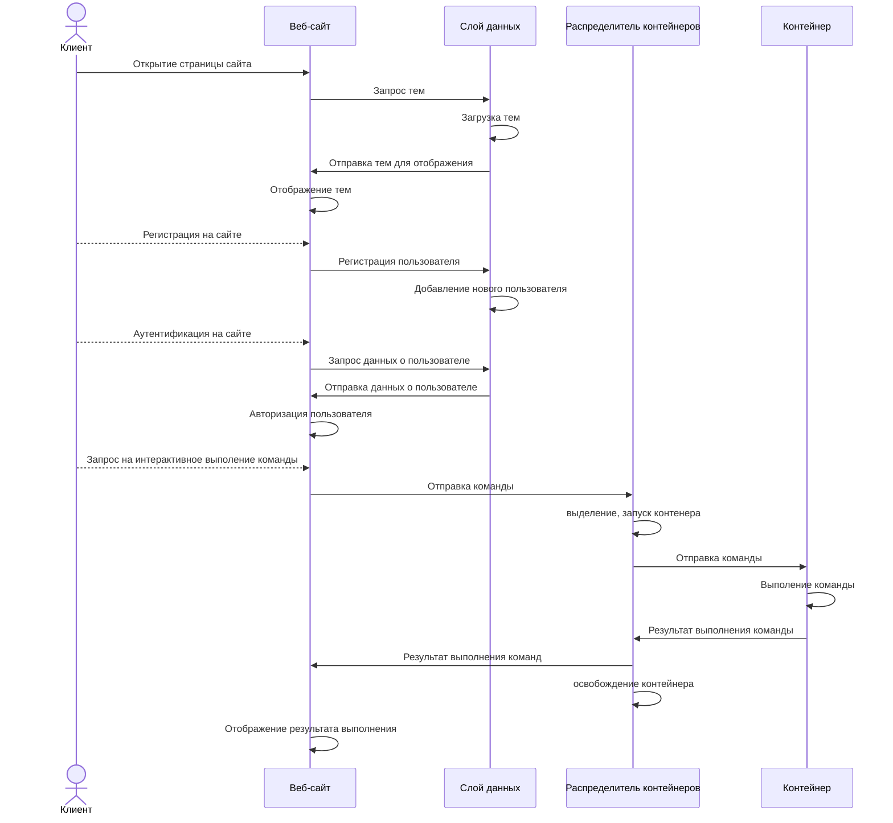
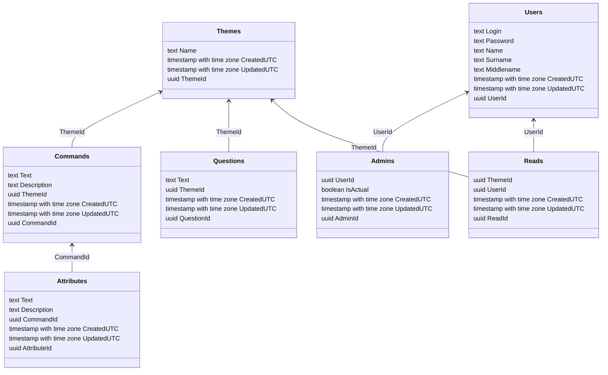
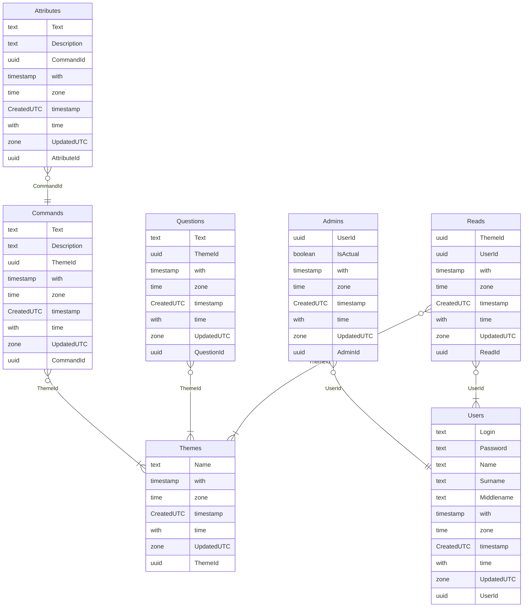

# Веб-сайт для обучения работе в командной строке операционной системы Linux с возможностью  интерактивного  выполнения команд

- Диаграмма взаимодействий

- Диаграмма логической модели базы данных

#Отношения

